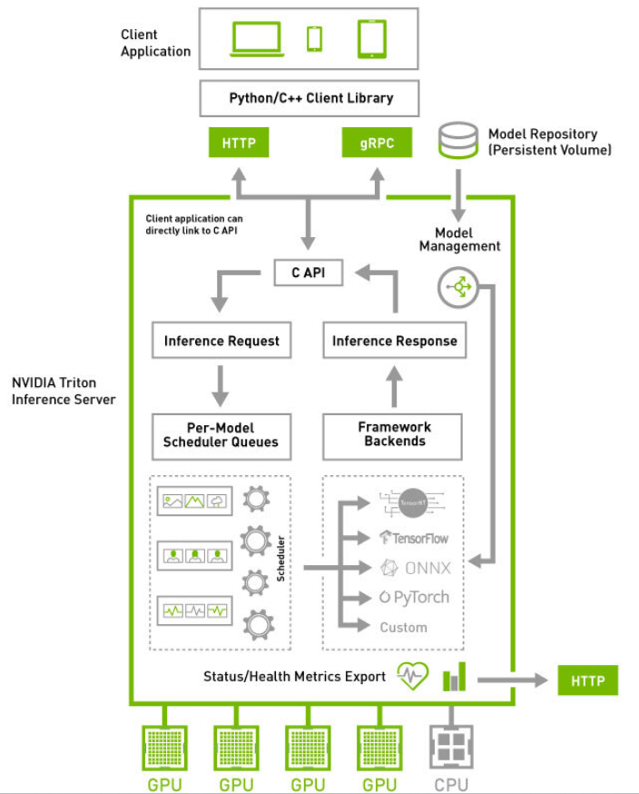

# Workload management
To manage `Triton inference server` with customized models as workload.

## Quick start

Use [docker-compose.yml](./docker-compose.yml) to start `Triton inference server`.

```bash
docker compose up -d
```

`Triton` start HTTP service at 8000, gRPC service at 8001 and expose metrics at 8002. Use follow command to verify `Triton inference server` is running correctly.

```bash
curl -v localhost:8000/v2/health/ready
```

## User Guide

### Deploying trained model

Somethings to mark first:
+ Perf Analyzer to sanity test the model
+ Model Analyzer to find best configuration
+ ModelWarmup to ensure that the model is sufficiently warmed up before being marked "READY" for inference.

### Architecture

+ The `model repository` is a file-system based repository of the models that `Triton` will make available for inferencing.
+ Inference requests arrive at the server side via HTTP/REST or GRPC or by the C API, and then routed to appropriate per-model scheduler.
+ Each model's scheduler optionally performs batching of inference requests and then passes the request to the `backend` corresponding to the model type.
+ The `backend` performs inferencing using the inputs provided in the batched requests to produce the requested outputs.
+ 
+ The `Triton` architecture allows multiple models and/or multiple instances of the same model to execute in parallel on the same system.
+ Models And Schedulers (@TODO)

### Model Repository

+ The repository paths are specified when Triton is started using the `--model-repository` option, which can be specified multiple times.
+ Model repository folder structure
  ```bash
    <model-repository-path>/
    <model-name>/
      [config.pbtxt]
      [<output-labels-file> ...]
      <version>/
        <model-definition-file>
      <version>/
        <model-definition-file>
      ...
    <model-name>/
      [config.pbtxt]
      [<output-labels-file> ...]
      <version>/
        <model-definition-file>
      <version>/
        <model-definition-file>
      ...
    ...
   ```
+ With each version sub-directory there must be the files required by that backend.
+ Model repository locations
  + Local file system
  + Google Cloud Storage
  + S3
    ```bash
    $ tritonserver --model-repository=s3://host:port/bucket/path/to/model/repository ...
    ```
  + Azure Storage
+ Model versions

### Repository Agent

+ A repository agent extends Triton with new functionality that operates when a model is loaded or unloaded.
+ This is BETA.

### Model Configuration

+ Each model in a model repository must include a model configuration that
  provides required and optional information about the model. Typically it is
  named `config.pbtxt`.
+ A minimal configuration must specify the platform and/or backend properties,
  the max_batch_size property, and the input and output tensors of the model.
+ The `ModelTensorReshape` property on a model configuration input or output is
  used to indicate that the input or output shape accepted by the inference API
  differs from the input or output expected or produced by the underlying
  framework model or custom backend.
+ Version policy

## FAQ

+ What is the relationship between model, its configuration and backend?
